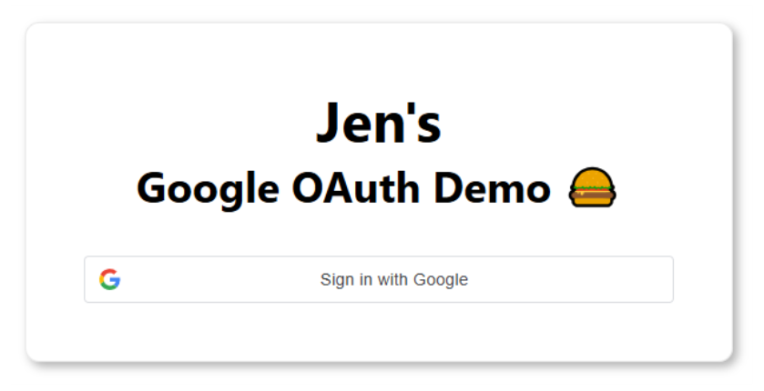
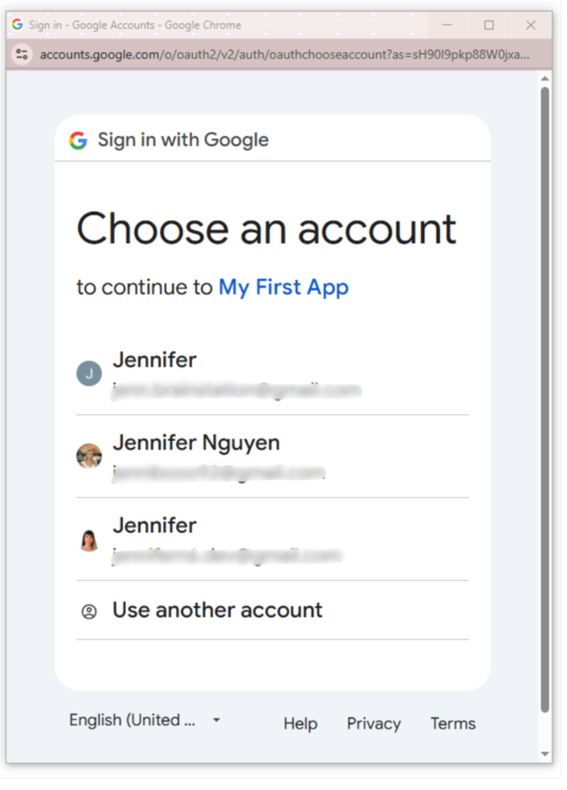

### Google OAuth React Demo

A simple React application demonstrating Google OAuth authentication.

##### 🚀 Features

- Google Sign-In integration
- User authentication flow
- Secure token handling

##### 🖼️ Screenshots

Sign in with Google.



Sign in with an email.



##### 🛠️ Setup

1. Clone the repo:
   ```sh
   git clone https://github.com/jennifern6/google-signin-react
   cd google-signin-react
   ```
2. Install dependencies:
   ```sh
   npm install
   ```
3. Create a `.env` file and add your Google OAuth credentials:
   ```sh
   REACT_APP_GOOGLE_CLIENT_ID=<Your Google Client ID here>
   ```
4. Start the app:
   ```sh
   npm start
   ```
   <br>

##### 🎯 Usage

Click the "Sign in with Google" button to authenticate and access user details.

<br><br>

##### 📜 License

This project is open-source and available under the [MIT License](LICENSE).
